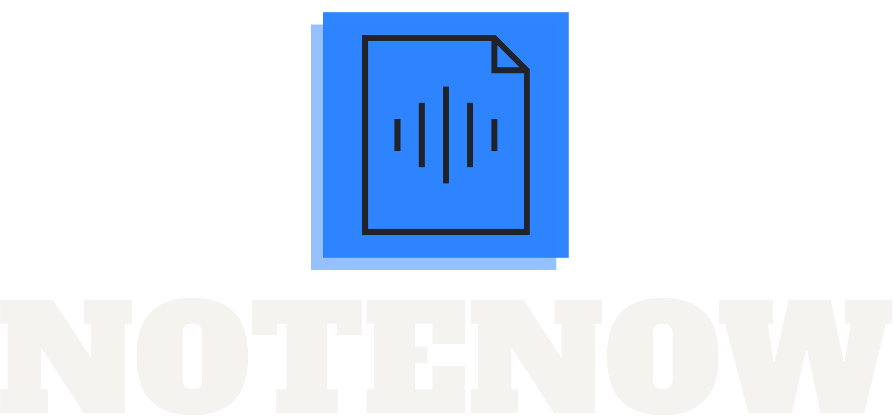

## Descripción

**Notely** es una aplicación web que permite a los usuarios crear, organizar y gestionar notas de manera sencilla y eficiente. Esta herramienta combina la funcionalidad de un gestor de notas tradicional con características avanzadas como la **transcripción automática de notas de audio** utilizando **Amazon Transcribe** y la **organización avanzada** mediante etiquetas y carpetas.

Con **Notely**, los usuarios pueden guardar notas en diferentes formatos (texto, audio e imágenes), configurar recordatorios y sincronizar sus notas en la nube, permitiendo el acceso desde cualquier dispositivo. Es una herramienta ideal para estudiantes, profesionales y cualquier persona que necesite un lugar centralizado para organizar ideas, tareas y proyectos.

## Características principales

- **Notas de Texto**: Crea notas de texto enriquecido con formato básico (negrita, cursiva, listas, etc.).
- **Notas de Audio**: Graba o sube archivos de audio y convierte automáticamente las grabaciones en texto utilizando **Amazon Transcribe**.
- **Transcripción de Audio**: Genera transcripciones de audio precisas, que pueden ser editadas, guardadas o compartidas.
- **Notas con Imágenes**: Añade imágenes a tus notas para complementar la información.
- **Organización con Etiquetas y Carpetas**: Asigna etiquetas y agrupa notas en carpetas para una mejor organización.
- **Búsqueda avanzada**: Busca notas por palabras clave, etiquetas o fechas.
- **Recordatorios**: Establece recordatorios en tus notas y recibe notificaciones en el momento adecuado.
- **Modo oscuro**: Cambia entre tema claro y oscuro para mejorar la experiencia visual.
- **Sincronización en la nube**: Accede a tus notas desde cualquier dispositivo con sincronización automática.
- **Exportación y Compartir**: Exporta notas a formatos PDF o texto plano, y compártelas con otras personas.

## Tecnologías utilizadas

- **Frontend**: [React.js](https://reactjs.org/) o [Next.js](https://nextjs.org/)
- **Backend**: [Node.js](https://nodejs.org/en/) con [Express.js](https://expressjs.com/)
- **Base de datos**: [MongoDB](https://www.mongodb.com/) o [PostgreSQL](https://www.postgresql.org/)
- **Almacenamiento**: [Amazon S3](https://aws.amazon.com/s3/) para archivos de audio e imágenes
- **Transcripción de audio**: [Amazon Transcribe](https://aws.amazon.com/transcribe/)
- **Autenticación**: [Firebase Authentication](https://firebase.google.com/docs/auth) o [Auth0](https://auth0.com/)
- **Notificaciones**: [Firebase Cloud Messaging](https://firebase.google.com/docs/cloud-messaging)

## Instalación

1. Clona el repositorio:
    ```bash
    git clone https://github.com/tu-usuario/notely.git
    ```

2. Instala las dependencias del backend:
    ```bash
    cd backend
    npm install
    ```

3. Instala las dependencias del frontend:
    ```bash
    cd frontend
    npm install
    ```

4. Configura las credenciales de AWS en el archivo de entorno `.env`:
    ```bash
    AWS_ACCESS_KEY_ID=tu-access-key-id
    AWS_SECRET_ACCESS_KEY=tu-secret-access-key
    AWS_REGION=tu-region
    ```

5. Inicia el servidor del backend:
    ```bash
    npm start
    ```

6. Inicia el servidor del frontend:
    ```bash
    npm run dev
    ```

## Contribuciones

¡Las contribuciones son bienvenidas! Si tienes alguna idea o mejora para **Notely**, siéntete libre de abrir un [issue](https://github.com/tu-usuario/notely/issues) o enviar un pull request.

## Licencia

Este proyecto está licenciado bajo la [Licencia MIT](LICENSE).

---

Esta descripción proporciona toda la información esencial para que los usuarios entiendan el proyecto y lo instalen correctamente. Si lo deseas, puedes personalizar las secciones como la instalación según la estructura específica de tu repositorio.
